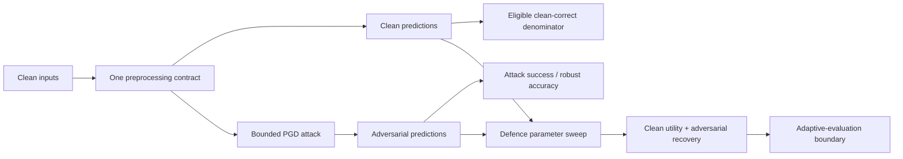

# Adversarial Robustness — Portfolio Reconstruction

This project reconstructs a 2024 adversarial-machine-learning assignment that explored **Projected Gradient Descent (PGD)** attacks and simple input defences around an ImageNet classifier.

The original course notebook came from the Adversarial Robustness Toolbox (ART) example and was extended for an assignment. This portfolio version does **not** present the starter notebook or third-party tutorial material as original work. Instead, it preserves the assignment-specific engineering lessons in independently written, reproducible code.

## What this project demonstrates

- bounded white-box PGD mechanics on a generic PyTorch classifier,
- explicit clean-vs-adversarial robustness metrics,
- defence parameter sweeps that evaluate clean utility and adversarial recovery together,
- correct denominator handling for attack success,
- one preprocessing/prediction contract for both clean and adversarial paths,
- and provenance-aware reconstruction of coursework.

## Historical source boundary

The recovered Drive history contains many similarly named variants of `attack_defence_imagenet_v2`. The base notebook states that it demonstrates ART with ResNet50, PGD, Spatial Smoothing, and adaptive white-box attacks; the DATA 450 assignment then asked students to change the image and sweep defence parameters.

A separate 2025 `Adversarial_Attacks.ipynb` is the UVADLC Tutorial 10 notebook with the original author's links and is treated as **reference material, not original portfolio work**.

See [`docs/AUDIT.md`](docs/AUDIT.md) for the version map and correctness findings.

## Robustness evaluation workflow



The diagram captures the implemented denominator and preprocessing corrections; it does not imply certification against adaptive attacks.

## Data and licensing

No ImageNet data, pretrained weights, or historical tutorial notebook is redistributed. Unit tests use small deterministic tensors, while optional PyTorch and ART integrations retain their upstream licenses.

## Why the historical sweep tables are not reused as benchmark results

The assignment-specific batch sweeps created a new ART `KerasClassifier(model=model, clip_values=(0, 255))` without the ResNet50 preprocessing adapter used earlier in the starter notebook. As a result, the sweep path did not preserve the model's expected input contract.

Other reproducibility issues included out-of-order execution in the gazelle notebook and a Gaussian-results container with no implemented Gaussian sweep.

The public project therefore keeps the **experimental design lesson** but not the old class/confidence tables as validated measurements.

## Reconstructed approach

1. Establish clean predictions and adversarial predictions under the same model preprocessing contract.
2. Report clean accuracy and adversarial/robust accuracy.
3. Compute attack success only among examples the clean model originally classified correctly.
4. Apply each defence parameter to clean and adversarial inputs through the same predictor.
5. Report both:
   - clean accuracy after defence, and
   - adversarial accuracy/recovery after defence.
6. Treat preprocessing defences as empirical mitigations, not guarantees; adaptive attacks can invalidate apparent gains.

## Repository structure

```text
src/adversarial_portfolio/
  attacks.py       # bounded PGD reference implementation
  metrics.py       # clean/adversarial/defended robustness metrics
  sweeps.py        # deterministic defence-sweep harness

tests/
  test_attacks.py
  test_metrics.py
  test_sweeps.py

docs/
  AUDIT.md

notebooks/
  robustness_sweep_demo.ipynb
```

## Install and test

```bash
python -m venv .venv
# Windows: .venv\Scripts\activate
# macOS/Linux: source .venv/bin/activate

python -m pip install -e ".[dev]"
pytest
```

The core reconstruction uses PyTorch so the correctness tests do not depend on TensorFlow/Keras session behavior. ART remains an optional integration dependency for reproducing ART-specific preprocessors and attacks.

```bash
python -m pip install -e ".[art]"
```

## Interpretation boundary

A defence that improves accuracy on one non-adaptive attack is not automatically robust. Robustness claims require a defined threat model, attack budget, attack restarts, adaptive evaluation against the defended pipeline, and a representative test set.

This repository is an educational robustness-engineering project, not a security certification of an ImageNet model.
