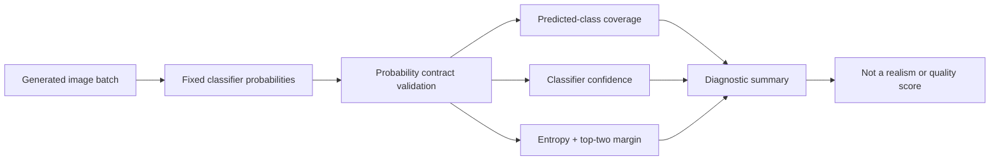

# CIFAR-10 Generated-Image Analysis — Portfolio Reconstruction

This project reconstructs the **analysis layer** of a 2024 CIFAR-10 GAN assignment. The historical GAN and CNN implementations were explicitly sourced from Jason Brownlee's Machine Learning Mastery tutorials, so this public portfolio does **not** present those tutorial models as original work.

The assignment-specific contribution was the analysis of 100 generated CIFAR-10 images using a separate CIFAR-10 classifier. This reconstruction preserves that evaluation idea, fixes several correctness problems, and makes the interpretation boundary explicit.

## What this project demonstrates

- validation of classifier probability outputs before analysis,
- batch-level analysis of generated images,
- predicted-class coverage and distribution summaries,
- class-conditional confidence statistics,
- entropy and top-two probability margin as classifier-certainty measures,
- safe image-range conversion,
- and provenance-aware reconstruction of generative-AI coursework.

## Important interpretation boundary

A classifier's maximum softmax probability is **not a realism score**. A classifier can be highly confident on an unrealistic or out-of-distribution image. This project therefore calls the quantity **classifier confidence**, not “how real” an image is.

Likewise, predicted-class coverage is not a substitute for FID, KID, human evaluation, nearest-neighbor checks, or other generative-model quality tests. It is only one diagnostic view of how a fixed classifier responds to generated samples.

## Historical source boundary

The recovered notebooks explicitly cite two Machine Learning Mastery tutorials:

- *How to Develop a GAN to Generate CIFAR10 Small Color Photographs*
- *How to Develop a CNN From Scratch for CIFAR-10 Photo Classification*

The later `Data-450-Assign-4B_CIFAR10GAN-Complete-1_.ipynb` adds assignment-specific analysis of generated images. That analysis, rather than the copied GAN/CNN implementation, is the basis of this reconstruction.

See [`docs/AUDIT.md`](docs/AUDIT.md) for the version map and findings.

## Analysis workflow



Because the historical generator and classifier artifacts are unavailable, this methodology diagram is used instead of an invented result chart.

## Data and licensing

No CIFAR-10 images, generated-image batch, tutorial model code, or trained model artifact is redistributed. The public notebook uses deterministic synthetic probabilities solely to exercise the independently written analysis contract.

## Reconstructed analysis contract

1. Accept a batch of generated images and a **single batch** of classifier probabilities.
2. Validate that probabilities are finite, non-negative, and each row sums to approximately 1.
3. Derive for each generated image:
   - predicted class,
   - maximum classifier confidence,
   - normalized predictive entropy,
   - top-two probability margin.
4. Summarize predicted-class counts and coverage.
5. Compute class-conditional confidence statistics safely, including classes with zero predicted samples.
6. Select top-confidence examples only as **classifier-confidence examples**, never as “most realistic.”

## Repository structure

```text
src/cifar10_portfolio/
  analysis.py      # probability validation and generated-image summaries
  images.py        # safe image-range conversion

tests/
  test_analysis.py
  test_images.py

docs/
  AUDIT.md

notebooks/
  generated_image_analysis_demo.ipynb
```

## Install and test

```bash
python -m venv .venv
# Windows: .venv\Scripts\activate
# macOS/Linux: source .venv/bin/activate

python -m pip install -e ".[dev]"
pytest
```

The original `generator_model_200.h5` and `final_model.h5` artifacts are not included and were not discoverable in the connected Drive during reconstruction. The public notebook therefore uses a small deterministic synthetic probability example to demonstrate the analysis contract without pretending to reproduce the historical model outputs.
