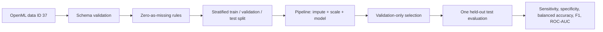

# Pima Diabetes ML Evaluation — Portfolio Reconstruction

This project reconstructs two 2024 machine-learning assignments that used **OpenML dataset 37, the Pima Indians Diabetes dataset**, to explore Support Vector Machines (SVMs) and multilayer perceptrons (MLPs).

The public version preserves the model-comparison lesson while correcting data leakage, test-set tuning, missing-measurement handling, and overly broad interpretation.

> **Educational retrospective only.** This project is not a clinical diagnostic model and must not be used for patient-care decisions.

## Dataset and population boundary

The historical notebooks load OpenML dataset 37. The dataset contains 768 women age 21 or older of Pima Indian heritage, with eight numeric predictors and a binary diabetes test outcome. It should not be described as representative of all patients with diabetes.

The OpenML-style columns are:

`preg`, `plas`, `pres`, `skin`, `insu`, `mass`, `pedi`, `age`, and target `class`.

Published reviews of this dataset note that zero values in plasma glucose, diastolic blood pressure, skin-fold thickness, serum insulin, and BMI are physiologically implausible and are commonly treated as missing measurements.

## Historical audit highlights

- The two large SVM notebooks are one project lineage, not separate projects.
- SVM kernels (`linear`, `rbf`, `poly`) were compared directly on the test split. That uses the test set for model selection.
- The SVM workflow did not standardize features and treated implausible zero clinical measurements as ordinary values.
- The SVM notebook added an `age_group` one-hot feature even though continuous age was already present; this is redundant feature engineering, not independent information.
- The neural-network notebook fit `StandardScaler` **before** train/test splitting, leaking test-distribution information into preprocessing.
- Several MLP architectures were then compared on the same test set, again using the test set for tuning.
- The saved SVM run reported 78.6% accuracy for the linear kernel on its reused test split; the saved MLP variants ranged roughly 69–75% accuracy. These are historical assignment outputs, not final unbiased estimates.

See [`docs/AUDIT.md`](docs/AUDIT.md) for details.

## Evaluation workflow



The workflow keeps all learned preprocessing inside the model pipeline and reserves the test set for final evaluation.

## Data and licensing

The reconstruction references [OpenML data ID 37](https://www.openml.org/d/37) and does not commit a dataset copy. Users should review the source record and its current terms before reuse; the README's narrow-population and missing-measurement boundaries remain part of the data contract.

## Reconstructed evaluation design

1. Load/validate the OpenML-37 schema.
2. Keep `Pregnancies` and `Age` zeros intact where meaningful; convert zero measurements to missing only for glucose, blood pressure, skin thickness, insulin, and BMI.
3. Put zero handling, median imputation, and standardization **inside** each scikit-learn pipeline.
4. Create stratified train/validation/test splits.
5. Choose SVM/MLP settings using training/validation data only.
6. Freeze the selected configuration.
7. Evaluate once on the held-out test set.
8. Report sensitivity, specificity, balanced accuracy, positive-class precision/F1, and ROC-AUC in addition to overall accuracy.

## Repository structure

```text
src/pima_diabetes_portfolio/
  data.py        # OpenML-37 schema + zero-as-missing transformer
  splits.py      # deterministic stratified train/validation/test split
  modeling.py    # leakage-safe SVM and MLP pipelines
  evaluation.py  # healthcare-relevant binary metrics

tests/
  test_data.py
  test_splits.py
  test_evaluation.py
  test_modeling.py

docs/
  AUDIT.md

notebooks/
  model_evaluation_demo.ipynb
```

## Install and test

```bash
python -m venv .venv
# Windows: .venv\Scripts\activate
# macOS/Linux: source .venv/bin/activate

python -m pip install -e ".[dev]"
pytest
```

The historical notebooks used `sklearn.datasets.fetch_openml(name="diabetes", version=1, as_frame=True)`. A reproducible live experiment can fetch **OpenML data ID 37** rather than relying on a mutable local CSV copy.

## Interpretation boundary

This small, old benchmark dataset has a narrow population and substantial missing-measurement artifacts. Model performance on it is useful for learning evaluation methodology; it does not establish clinical validity, modern population generalizability, calibration for care, or diagnostic safety.
