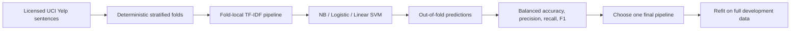

# Restaurant Review Sentiment Evaluation — Portfolio Reconstruction

This project reconstructs the meaningful NLP evaluation work from a 2024 DATA 460 restaurant-review sentiment assignment.

The historical notebook compared Bag-of-Words classifiers and a VADER baseline, but its learned text vocabulary was fit **before** cross-validation and the final sample-review predictor reused the classifier left fitted on the last CV fold. The public reconstruction keeps the model-comparison lesson while correcting those evaluation defects.

## Data and licensing

The reconstruction targets the **Yelp subset** of UCI's *Sentiment Labelled Sentences* dataset:

- 1,000 Yelp review sentences,
- 500 positive and 500 negative,
- binary labels,
- no missing values,
- DOI: `10.24432/C57604`,
- license: CC BY 4.0.

Dataset page:

https://archive.ics.uci.edu/dataset/331/sentiment+labelled+sentences

The repository does not redistribute the dataset. See [`data/README.md`](data/README.md).

## Historical audit highlights

- `CountVectorizer.fit_transform(corpus)` is executed on all reviews before K-fold evaluation, so each held-out fold influences the learned vocabulary.
- The first large model comparison uses ordinary `KFold(n_splits=11)` rather than stratified folds.
- Thirteen classifiers are compared on the same CV process without a separate selection/evaluation stage.
- Saved results show substantial train/test gaps for several high-capacity models.
- The final AdaBoost section later switches to `StratifiedKFold`, but still uses the already globally fitted vocabulary.
- The sample-review helper uses `ada_boost_classifier` after the CV loop; at that point the estimator is fitted only on the **last fold's training partition**, not refit on the full development dataset.
- A later standalone report is labeled “Fold 12” even though the declared first loop has 11 folds, demonstrating stateful notebook reuse.
- VADER assigns compound score `0` to the negative class by construction and is evaluated on the same full curated dataset without uncertainty analysis.

See [`docs/AUDIT.md`](docs/AUDIT.md).

## Evaluation workflow



Keeping vectorization inside each fold prevents held-out reviews from influencing the learned vocabulary.

## Reconstructed evaluation contract

1. Load and validate review text + binary labels.
2. Keep vectorization **inside each scikit-learn Pipeline** so vocabulary/IDF are learned only from training folds.
3. Use deterministic `StratifiedKFold`.
4. Compare a small, declared text-model set:
   - Multinomial Naive Bayes,
   - Logistic Regression,
   - Linear SVM.
5. Generate out-of-fold predictions for each model.
6. Report accuracy, balanced accuracy, positive precision/recall/F1, macro-F1, and confusion counts.
7. Choose a final model only after CV comparison.
8. Refit that final pipeline on the full development dataset before predicting new review strings.
9. Treat VADER as an optional rule-based baseline, not as a directly equivalent learned classifier.

## Historical saved observations

The original notebook's leakage-prone 11-fold model comparison reported approximately:

| Model | Saved testing accuracy |
| --- | ---: |
| SVC | 80.8% |
| Random Forest | 80.2% |
| Extra Trees | 79.5% |
| Multinomial NB | 79.4% |
| Gradient Boosting | 78.2% |
| AdaBoost (later stratified run) | 76.4% |

These are historical assignment outputs, **not** reproduced benchmark claims.

## Repository structure

```text
src/sentiment_portfolio/
  data.py        # UCI Yelp labelled-sentence parser/validation
  modeling.py    # leakage-safe text pipelines
  evaluation.py  # stratified out-of-fold model comparison
  vader.py       # optional analyzer adapter

tests/
  test_data.py
  test_modeling.py
  test_evaluation.py
  test_vader.py

docs/
  AUDIT.md

data/
  README.md

notebooks/
  sentiment_evaluation_demo.ipynb
```

## Install and test

```bash
python -m venv .venv
# Windows: .venv\Scripts\activate
# macOS/Linux: source .venv/bin/activate

python -m pip install -e ".[dev]"
pytest
```

For the optional VADER baseline:

```bash
python -m pip install -e ".[vader]"
```

## Interpretation boundary

This dataset intentionally contains clearly positive or negative sentences and excludes neutral examples. Performance on it does not establish robustness to sarcasm, mixed sentiment, domain shift, long-form reviews, multilingual text, or production moderation/customer-experience use.
