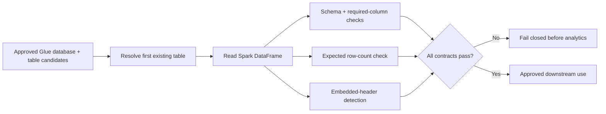

# AWS Glue + EMR PySpark Ingestion Validation — Portfolio Reconstruction

This project reconstructs the meaningful engineering work from 2024 DATA 445 PySpark/AWS notebooks. The historical Week 5 notebook is an instructor-adapted tutorial and is not presented as original portfolio code. The later AWS workspace shows the more useful contribution: debugging an AWS Glue catalog table name and validating a Home Credit application dataset from an EMR PySpark session.

## What the historical AWS run actually did

The EMR notebook:

1. created/reused a Spark session,
2. selected Glue database `hcdb`,
3. attempted `hc_application_csv` and received a table-not-found error,
4. switched to `hc_applications`,
5. inspected schema,
6. counted rows,
7. inspected the first row,
8. ran descriptive statistics.

The public reconstruction describes this accurately as **catalog and ingestion validation**, not as a complete ETL pipeline.

## High-impact audit finding: the CSV header was ingested as data

The saved EMR output reports `df.count() == 307512`, but numeric columns in `df.describe()` have counts of 307511. The first row contains literal header strings such as `NAME_CONTRACT_TYPE`, `CODE_GENDER`, and `OCCUPATION_TYPE`, while numeric fields are null.

That is consistent with a catalog/CSV configuration that retained the header row as a record. The reconstructed validation code detects this condition explicitly instead of trusting a successful Spark read.

## Provenance boundary

The Week 5 notebook identifies itself as a UMGC PySpark tutorial adapted from a Towards Data Science beginner guide. Its source differs from the tutorial copy only in minor path/display edits. It remains historical learning material, not original portfolio implementation.

The EMR notebook is the portfolio-relevant artifact because it records a real catalog-name failure, the corrected table choice, and live AWS/Spark output exposing the ingestion defect.

See [`docs/AUDIT.md`](docs/AUDIT.md) for details.

## Ingestion-quality workflow



The flow makes the central evidence visible: a successful catalog read is only the start of ingestion validation.

## Data and licensing

No Home Credit dataset, AWS credential, catalog export, or cloud resource is distributed. The notebook uses Spark-compatible test doubles; reproducing the historical cloud path requires separately authorized data and AWS access under their applicable terms.

## Reconstructed engineering contract

The public utilities provide:

- safe Spark/Glue catalog identifier validation,
- deterministic resolution of the first existing catalog table from approved candidates,
- DataFrame shape/schema inspection through a Spark-compatible interface,
- embedded-header detection based on first-row values versus column names,
- required-column and expected-row-count checks,
- fail-closed validation before downstream analytics.

The core checks use duck-typed Spark interfaces so they can be unit-tested without an AWS cluster. PySpark is an optional dependency for real Spark integration.

## Repository structure

```text
src/spark_portfolio/
  catalog.py       # safe catalog table resolution
  validation.py    # DataFrame/header/schema validation

tests/
  test_catalog.py
  test_validation.py

docs/
  AUDIT.md

notebooks/
  ingestion_validation_demo.ipynb
```

## Install and test

```bash
python -m venv .venv
# Windows: .venv\Scripts\activate
# macOS/Linux: source .venv/bin/activate

python -m pip install -e ".[dev]"
pytest
```

For a local/current Spark runtime:

```bash
python -m pip install -e ".[spark]"
```

The historical Week 5 notebook pinned PySpark 3.0.1. The reconstruction isolates Spark as an optional dependency so the validation logic can remain testable independently of a specific cluster image.

## Interpretation boundary

A successful catalog lookup and schema read do not prove ingestion correctness. Header handling, row counts, null behavior, schema inference, partitioning, duplicate rows, and source-to-catalog consistency must be validated before downstream analytics.
